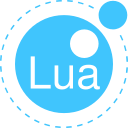

### What I'd Love to Use More of

  
        

### What I'm Excited to Learn

  
  
  
  <a href="https://www.lua.org/" target="_blank" rel="noreferrer">
    <picture>
      <source media="(prefers-color-scheme: light)" srcset="./lua-light.svg">
      <source media="(prefers-color-scheme: dark)" srcset="./lua-dark.svg">    
      
    </pictiure>
  </a>

### What I Nerd out on

  <a href="https://en.wikipedia.org/wiki/Linux" target="_blank" rel="noreferrer">
    <picture>
      <source media="(prefers-color-scheme: light)" srcset="./linux-light.svg">
      <source media="(prefers-color-scheme: dark)" srcset="./linux-dark.svg">    
      
    </pictiure>
  </a>

<!--
**joshuahamlet/joshuahamlet** is a ✨ _special_ ✨ repository because its `README.md` (this file) appears on your GitHub profile.

Here are some ideas to get you started:

- 🔭 I’m currently working on ...
- 🌱 I’m currently learning ...
- 👯 I’m looking to collaborate on ...
- 🤔 I’m looking for help with ...
- 💬 Ask me about ...
- 📫 How to reach me: ...
- 😄 Pronouns: ...
- ⚡ Fun fact: ...
-->
