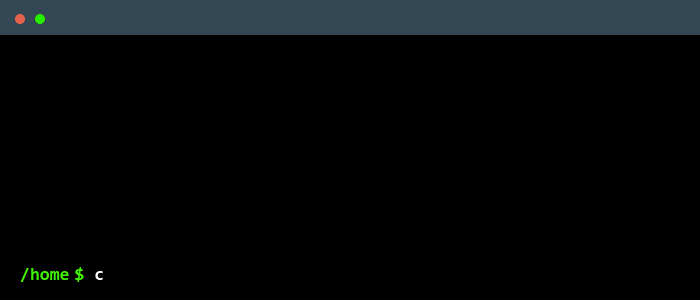

<pre>
ooooo                       oooo                    oooo                        
`888'                       `888                    `888                        
 888  ooo. .oo.  .oo.        888  .ooooo.   .oooo.o  888 .oo.                   
 888  `888P"Y88bP"Y88b       888 d88' `88b d88(  "8  888P"Y88b                  
 888   888   888   888       888 888   888 `"Y88b.   888   888                  
 888   888   888   888       888 888   888 o.  )88b  888   888   .o. .o. .o. 
o888o o888o o888o o888o  .o. 88P `Y8bod8P' 8""888P' o888o o888o  Y8P Y8P Y8P 
                         `Y888P                                                 
</pre>

<!--
**joshuahamlet/joshuahamlet** is a ✨ _special_ ✨ repository because its `README.md` (this file) appears on your GitHub profile.

Here are some ideas to get you started:

- 🔭 I’m currently working on ...
- 🌱 I’m currently learning ...
- 👯 I’m looking to collaborate on ...
- 🤔 I’m looking for help with ...
- 💬 Ask me about ...
- 📫 How to reach me: ...
- 😄 Pronouns: ...
- ⚡ Fun fact: ...
-->
