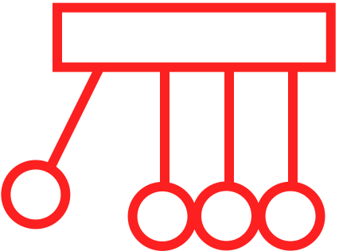
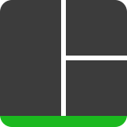

### What I Use

  
  
  
  
  <a href="https://astro.build/" target="_blank" rel="noreferrer">
    <picture>
      <source media="(prefers-color-scheme: light)" srcset="https://astro.build/assets/press/logomark-light.svg">
      <source media="(prefers-color-scheme: dark)" srcset="https://astro.build/assets/press/logomark-dark.svg">
      
    </picture>
  </a>
  <a href="https://nextjs.org/docs" target="_blank" rel="noreferrer">
    <picture>
     <source media="(prefers-color-scheme: light)" srcset="https://raw.githubusercontent.com/danielcranney/readme-generator/main/public/icons/skills/nextjs-colored.svg">
     <source media="(prefers-color-scheme: dark)" srcset="https://raw.githubusercontent.com/danielcranney/readme-generator/main/public/icons/skills/nextjs-colored-dark.svg">
      
    </picture>
  </a>
  
  
  
  
  <a href="https://expressjs.com/" target="_blank" rel="noreferrer">
    <picture>
    <source media="(prefers-color-scheme: light)" srcset="https://raw.githubusercontent.com/danielcranney/readme-generator/main/public/icons/skills/express-colored.svg">
    <source media="(prefers-color-scheme: dark)" srcset="https://raw.githubusercontent.com/danielcranney/readme-generator/main/public/icons/skills/express-colored-dark.svg">
    
  </picture>
  </a>
  
  
  
  
  

### What I'd Love to Use More of

  
  
  <a href="https://unity.com/" target="_blank" rel="noreferrer">
    <picture>
      <source media="(prefers-color-scheme: light)" srcset="./unity-light.svg">
      <source media="(prefers-color-scheme: dark)" srcset="./unity-dark.svg">
      
    </picture>
  </a>
  
  
  
  
  
  

### What I'm Excited to Learn

  
  
  
  
  <a href="https://www.lua.org/" target="_blank" rel="noreferrer">
    <picture>
      <source media="(prefers-color-scheme: light)" srcset="./lua-light.svg">
      <source media="(prefers-color-scheme: dark)" srcset="./lua-dark.svg">    
      
    </pictiure>
  </a>
  
    

### What I Nerd out on

  <a href="https://en.wikipedia.org/wiki/Linux" target="_blank" rel="noreferrer">
    <picture>
      <source media="(prefers-color-scheme: light)" srcset="./linux-light.svg">
      <source media="(prefers-color-scheme: dark)" srcset="./linux-dark.svg">    
      
    </pictiure>
  <a href="https://en.wikipedia.org/wiki/Vim_(text_editor)" target="_blank" rel="noreferrer">
    
  <a/>
  <a href="https://neovim.io/" target="_blank" rel="noreferrer">
    
  
  <a href="https://swaywm.org/" target="_blank" rel="noreferrer">
    
  <a/>
  <a href="https://i3wm.org/" target="_blank" rel="noreferrer">
    
  <a/>
  <a href="https://www.gnu.org/software/bash/" target="_blank" rel="noreferrer">
    
  <a/>
  <a href="https://github.com/tmux/tmux/wiki" target="_blank" rel="noreferrer">
    
  <a/>

### Socials
  

    
    
    
  

<!--
**joshuahamlet/joshuahamlet** is a ✨ _special_ ✨ repository because its `README.md` (this file) appears on your GitHub profile.

Here are some ideas to get you started:

- 🔭 I’m currently working on ...
- 🌱 I’m currently learning ...
- 👯 I’m looking to collaborate on ...
- 🤔 I’m looking for help with ...
- 💬 Ask me about ...
- 📫 How to reach me: ...
- 😄 Pronouns: ...
- ⚡ Fun fact: ...
-->
